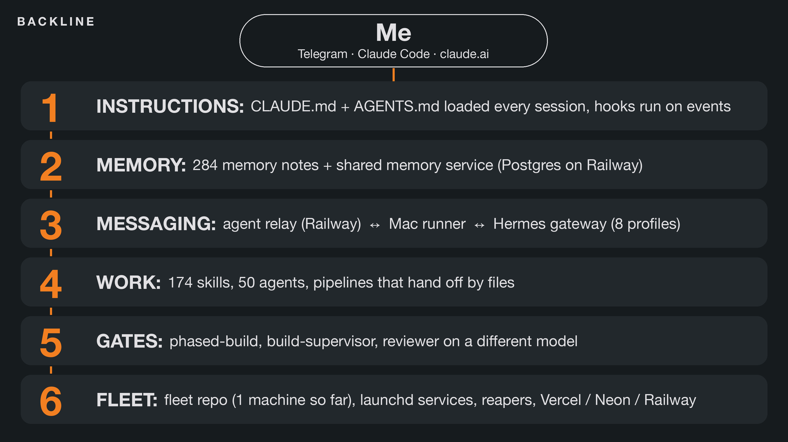

# How my AI team actually works



This is the system behind my AI team as of October 3, 2026: what runs, when, what it checks, and what happens when it breaks. I call the whole thing Backline. Counts come from files and queries I ran on 10/3, and incident details come from notes I wrote at the time. It's a lot of machinery for one person, and almost all of it exists because something broke first. Some parts are enforced by code and others are conventions, and one service is switched off right now, so I flag which is which as I go. The last section maps each idea to a starter file in this repo.

## The short version

Most AI employee setups are a folder of role prompts. Mine has six layers, and the role prompts are one piece of one of them.

```
                         me
          (Telegram, Claude Code, claude.ai)
                          |
 1. INSTRUCTIONS   two doctrine files loaded every session, hooks on events
 2. MEMORY         284 notes + a shared memory service (Postgres)
 3. MESSAGING      relay <-> Mac runner <-> Hermes gateway (8 profiles)
 4. WORK           174 skills, 50 agents, pipelines that hand off by file
 5. GATES          build ledger, phased builds, a reviewer on another model
 6. FLEET          fleet repo (1 machine so far), launchd services, reapers, hosting
```

The habit that holds it together is turning most failures into a rule and putting that rule in the layer that can enforce it. A writing preference ends up as a line in an instruction file, while a risky shell command in Claude Code gets a hook that won't run it until the agent has recorded a decision. When a Python process ran away, the fix was a reaper on a 10-minute timer. A bad ad launch turned into a rule with the incident attached.

## 1. Instructions

I keep two files with one doctrine. `~/AGENTS.md` (50 lines) is what Codex reads. `~/.claude/CLAUDE.md` (97 lines) is what Claude Code reads, and its first 50 lines match the other file apart from one path. A session started in my home folder loads both, so the doctrine sits in context twice.

The doctrine is behavioral. Default scale is 1000x and timelines compress 20x: a month becomes 1.5 days, a 90-day sprint about 4.5. Those numbers are there to stop agents from sizing plans to what feels comfortable, and "let's be realistic" is banned in favor of "decompose, parallelize, fan out." One clause lists the real constraints (messaging law, platform rules, deliverability, security), says to follow them, and says to kick off outside review clocks like carrier approval and DNS first.

Two more rules apply everywhere: "do it, don't instruct" (if a tool can do the step, the agent does it) and "write like a person" (a banned-word list, contractions, no em or en dashes). CLAUDE.md adds a web gate (a new site runs the `website-build` skill before any UI code), the token rules from section 8, and a memory duty. That duty means searching shared memory before asking me something that may already be known, recording a decision before anything that spends, sends, deploys, changes DNS or deletes, and recording the outcome after.

### Hooks: rules that don't depend on the model remembering

Hooks in `~/.claude/settings.json` fire on session start and end, around every tool call, on stop, and on each prompt. Most only observe, and one can refuse a command.

**The decision gate is the hook I rely on most.** It turns "record a decision before deploying" into a habit with a hook behind it. Before certain risky shell commands in Claude Code, the hook looks for a decision the agent recorded recently in the same session. If there isn't one, it refuses to run the command and tells the agent to write one first. After the command runs, it logs what happened. At session start, one line reports decisions more than a day old with no outcome (3 today).

What the hook builds is the habit of writing the prediction down first. It doesn't judge whether the decision was any good, and it isn't a security control. A human yes is a convention in my instructions that neither the hook nor the harness enforces. The few actions that do wait for my word are activating a lesson, turning on ads, and fan-outs past the usage gates.

Three other hooks do mechanical jobs. A **skill lock guard** (188 lines) hashes the lock-tracked skills against a vault copy at session start, because a skills update can silently rewrite them, and prints a restore command. A **tracker hook** stamps each project's last-activity on my project board at session end, and creates a row (with the repo name) for a project it hasn't seen. It skips linked worktrees and sessions that aren't in a git repo or under my projects folder. A **Backline event log** records every tool call, prompt and stop as one JSON line of metadata only: tool, session and agent IDs, a skill or subagent name, the project folder name, the first word of a shell command, an error flag. It never stores prompt text, inputs or outputs, and it rotates to one backup file.

Harness settings back up the routing rules in section 8: the default model is `opusplan`, effort is medium, and subagents default to Sonnet.

## 2. File memory: where the scar tissue lives

`~/.claude/projects/<home>/memory/` holds 286 markdown files: 284 notes (2 user, 47 feedback, 199 project, 36 reference) and two index files. Every note has a name, a one-line description and a type. Feedback notes carry the reason along with the rule: 46 of the 47 have a Why block and all 47 have How to apply. Project notes mostly record state, so only 147 of all 284 have an explicit Why. A feedback note looks like this:

```markdown
---
name: feedback-<slug>
description: "HARD <date>: <the rule in one line>"
metadata:
  type: feedback
---
<the rule, in a sentence or two>

What happened: <the incident, with numbers>
**Why:** <the principle behind the rule>
**How to apply:** <what to do differently next time>
Related: [[another-note]]
```

Keeping the incident in the same note as the rule is the key choice. The one-line index entry is what loads every session, and the full story is one file read away. A bare rule ("audit the journey") gets followed literally or ignored. A rule an agent can trace to what it cost generalizes to cases nobody wrote down. The `[[wikilinks]]` make a graph you can grep. It isn't linted: roughly 1 link in 12 points at a note that no longer exists.

**Hot index, cold archive.** `MEMORY.md` is the hot index: 147 lines, 18,625 bytes, with 136 bullets that index 174 notes. `MEMORY-archive.md` (89 lines, 12,733 bytes) indexes the other 110, and agents read it only when a topic matches. Each session loads the two instruction files and the hot index, and nothing loads the note bodies until an agent opens one.

The split came from a measurement, the token diet on 9/13. Each turn carried about 99,000 tokens of fixed context, about 58,000 of it from the skills list, the hot index and MCP tool names. The fixes: cap skill descriptions near 230 characters (all 152 got capped), keep new index lines short, move cold sections to the archive, and compact at about 350,000 tokens. Nothing checks the caps, and today 10 of 174 skill descriptions run past 240 characters.

**HARD rules.** 24 entries in the hot index carry a HARD tag, and 5 more sit in the archive. The hot ones are always in context. A sample of HARD notes:

| Date | Rule | What caused it |
|---|---|---|
| 9/1 | Sales assets aren't done until they're ready to fire in under a minute | 20 briefs built 8/9, never sent |
| 9/4 | Headless browsers by default, never loop visible windows | Chrome windows popping up over and over |
| 9/20, revised 9/27 | No agent cap, one writer per shared resource, and usage gates at 50% and 75% | 9 agents on one database burned the weekly allowance in an afternoon |
| 9/22 | Prove the whole customer journey before anything goes live | Ads promised texting while SMS was off |
| 9/27 | Worker prompts open with WHY YOU ARE HERE | 9 of 12 workers followed the latest chat |
| 10/1 | No multiprocessing in stdin-fed Python | 17 hours of runaway process |

Status words work as controls. `LIVE` is the one tag I use consistently, and words like parked, retired and on hold in an index line tell the next agent whether to build, leave alone or check first. Nothing enforces that vocabulary. When I put a project on hold on 9/29, I recorded it in the note, the shared memory service, Hermes memory files, the Codex instructions, the README and STATUS banners of the main project repo, and 14 tracker rows. That didn't stop everything: the site's Vercel crons and some monitors kept running, and the services burning database hours were shut down separately on 10/1. The note lists what I stopped and how to resume.

## 3. The memory service: one brain across my main surfaces

Files are one store. A memory service on my own Railway account is the second. My main sessions read and write it: Claude Code, Codex, Hermes (7 of its 8 profiles), claude.ai and ChatGPT. ChatGPT is the one surface on a per-agent token. The 50 subagent pages have no access to it. I built it after a third-party memory plugin failed quietly: its worker process was missing, every route returned 404, and its state database stayed at 0 bytes. The lesson I wrote down was to prove persistence across processes and restarts before saying memory works.

It's Postgres with pgvector behind a plain `node:http` API. One codebase runs three roles: the API, a claude.ai connector and a nightly dreamer. The local MCP server has 14 tools, and MCP is only the protocol. Policy lives in the API, and every write records a source agent. On the shared operator secret that my main surfaces use, that name is self-reported. I retired the old local copy on 9/27. It was a dead second copy that could have become a write path if a client ever left its URL unset, and it kept crash-looping.

### How search ranks

Embeddings are `all-MiniLM-L6-v2` run in-process (384 dimensions, free). Long text is cut into chunks and mean-pooled. A vector index and a full-text index sit side by side, so a row whose embedding failed is still found by text.

`score = similarity x trust x decay`. Similarity is the larger of cosine and full-text rank. Trust comes from a tier on each row (high, medium, low, quarantined), and quarantined rows are hidden by default. Decay is age-based with a floor, fastest for hypotheses, slower for observations and slowest for procedures and pointers. Reads never write and nothing updates a "last used" field, so searching a stale fact over and over can't keep it alive.

Relations are typed (supports, contradicts, depends_on, invalidates, relates), plus a supersedes link, created automatically when a write names the fact it replaces. **`low_support`:** search returns a support score from 0 to 1. Below a support threshold the store says it doesn't know, and agents are told to say so or ask me instead of padding an answer from vague matches.

### The learning loop: decisions, outcomes, lessons

This is the piece I'd copy first, even in plain files. It's an append-only ledger, and nine tables carry a Postgres trigger that rejects updates and deletes.

1. **Decision, before acting.** Stimulus, assumption, prediction, decision, rationale, and optionally a metric with a horizon date. The service snapshots the memories used as evidence, each with a content hash, so later edits can't rewrite what the decision rested on.
2. **Outcome, after.** What happened, whether the prediction held, and one of eight signals (positive, negative, correction, override, assumption violated, approval, review finding, inconclusive). Outcomes are appended, never overwritten.
3. **Evidence is graded.** Every outcome is tagged `human_judgment`, `real_observation`, `model_inference` or `simulation_output`. Only the first two grades count toward lessons. A cap keeps an agent's own outcome at `model_inference`, but it applies only to per-agent tokens, and today only ChatGPT uses one. My other surfaces share the operator secret. There the grade follows a rule (measurements attached means `real_observation`, an approval signal means `human_judgment`) that an agent can satisfy itself.
4. **Lessons need a bar.** A procedural lesson needs several decisions with outcomes, from more than one agent, on more than one day, every latest outcome positive and none corrected. Agent names are self-reported on the shared path, so "more than one agent" checks habits and can't prove identity. A measurable lesson needs a development run plus several holdout runs on different case sets with no regression, and passing earns `evaluated`, never `active`.
5. **Activation** is a separate step, and Claude only runs it when I name the lesson ID. An active lesson switches itself off if a source memory is later quarantined or superseded, or a later real outcome contradicts it.

A **scorer** runs every 15 minutes and resolves decisions that carry a horizon and a metric by looking for a matching real measurement. With none, it writes a finding with the prediction marked unknown, because a gap is never a pass. A **dreamer** runs nightly on DeepSeek flash. It imagines variants of the day's anomalies and replays them against an agent's rules file with fake tools whose side effects always fail. It can't activate a lesson. Its output is tagged as simulation or model inference, but its simulated runs do count toward a measurable lesson reaching `evaluated`, so activation, which needs my explicit word, is the human gate.

The ledger today: the memory service's own project has 1 lesson, still a candidate, and 0 active, so nothing there has cleared the bar yet.

**Releases get a reviewer too.** Each release wave is reviewed by a different model. DeepSeek reviewed waves 4 to 6 and 8 to 11 from the package alone, with no shell. The script writes the receipt instead of the builder, and the review script refuses a PASS with a critical or high finding. Codex reviewed wave 3 and ran the test suite. Waves 1, 2 and 7 have no receipt of their own. The reviewer caught a real bug in wave 5.

## 4. Messaging: how agents and I talk

### The relay

The relay is a small Node service on Railway with a database on a volume. Seven agents are active on it (one more was deactivated on 9/27): me, Claude, Codex, Hermes, an approvals gateway (offline since 10/1), a send-only notifier from my web app and a test probe. A message has a thread, sender, recipient, a JSON payload, an expects-reply flag, a hop count and one of 7 kinds: text, question, task, finding, metrics, report, alert.

- **Durable first, delivered second.** A message is written, then pushed. Acks are separate from the push, so a dropped connection can't lose one. A claim is an exclusive lease, and a periodic sweep re-pushes new messages and expires stale leases. Delivery is at-least-once, so side effects have to be idempotent.
- **Bounded retries.** A message that keeps failing is marked failed after a few attempts instead of looping.
- **Loop breaker.** Each agent-to-agent hop counts up, and past a cap with no human in the thread the next message is held and I get a report.
- **Pause switch** stored in the database, so it survives restarts.

### The Mac runner

A launchd service holds one WebSocket per local agent (4 lanes) and turns messages into work. Each lane runs one message at a time. On the Claude and Codex lanes, runs are headless with a hard timeout (Claude runs also have a turn limit), and a run that goes over its time has its whole process group killed, so a hung agent can't hold the lane. The Hermes and Telegram lanes hand the text to their gateways. It keeps one CLI session per agent per thread (213 sessions across 180 threads today), so follow-ups keep their context.

Health checks run at two levels. On a short timer the runner checks the relay is up and forces a reconnect if it fails or the relay shows fewer sockets than lanes. Each lane also pings on its own timer, gives up after a missed pong, and reconnects with backoff.

### Hermes

Hermes is the gateway on my Mac and my Telegram front door. Since 10/2, one gateway under launchd serves 8 profiles, all on DeepSeek flash. The fix followed a Hermes update on 10/1 that sent the standalone gateway into a crash loop and left Telegram down for roughly 18 hours.

Hermes carries my Telegram messages into the relay, an agent answers on the thread, and the reply lands back in Telegram. The gateway also ticks every profile's cron store, 19 enabled jobs in all.

## 5. Work: skills and agents that hand off through files

There are 141 skill folders in `~/.claude/skills` plus 33 symlinked in from other tool folders, so 174 load from my folder, and plugins add more. At least 80 of those 174 are open-source installs I didn't write, closer to 100 once the other upstream installs are counted. Roughly 31 are `seo*` skills, mostly from the open-source claude-seo plugin, and 49 come from the open-source marketingskills library. A scattering of animation, design and sales skills come from other repos.

Of the 50 agents, 32 are mine (21 copywriter personas and 11 reel workers), and the other 18 are SEO specialists from the same SEO plugin. Stages hand off through named files (`PRODUCT.md`, `DESIGN.md`, a build ledger, `script.md`, `cut.mp4`) instead of conversation, so any stage can be inspected, restarted or handed to another model.

**website-build** runs stages 0 to 9 and has four locks before any code: a buyer plus one action, real tokens in a committed DESIGN.md, a named structural archetype, and a signature element. Conversion is spelled out: a three-field form, phone visible above the fold, fixed click-to-call on mobile, and 6 fixed analytics events. A script opens a headless browser at phone size and fails on a broken analytics setup. It can't prove events arrive, because analytics libraries drop headless traffic, so that takes a real tab. Review is capped at one fix batch and a confirm round, plus one more fix batch if the confirm round is still red.

**The reel line** has 11 agent pages. The scripted Sunday chain uses 10:

```
scout -> topics -> hooks -> script -> check -> shotlist
      -> cut -> captions -> covers -> [I post] -> file
```

The 11th, `reel-capture`, serves a capture-first mode that skips script, check and shotlist. Each page checks its inputs before doing its one job, then stops. Where a pick is mine, the page writes a stop marker and the next agent refuses to continue while it's there. No page posts, comments or follows anywhere, and the capture page also bans hard-deletes and AI generation. Every page has a "Never" section, so a wrong output gets fixed by adding a line to the page instead of arguing in chat.

**The copy personas** are 21 prompts I wrote, each modeled on a well-known direct-response or advertising writer. Those writers had no part in them. Missing facts come back as `[NEED: ...]`, never invented.

**Five AI employees** (built 10/1): chief of staff, revenue desk (parked, never run), content producer, research scientist and build supervisor. The other four run on request, and nothing is scheduled. Each reports to the chief of staff through a `STATUS.md` capped at 20 lines, and one script sweeps all five and flags a break (build supervisor's file is over the cap right now).

Only research feeds the build supervisor, through a `HANDOFF.md` with exactly six sections (objective, acceptance tests, constraints, known state, open assumptions, sources), and the supervisor refuses an incomplete one. Research has three tiers: quick, standard and deep. A deep run is about 102 agents and 10.4M tokens, and it waits for my yes per question. A brief from another agent is only a pointer. If no message from me sits behind it, nobody asked for the build and it isn't built.

## 6. Gates: how work gets proven

I don't trust "done," so two skills gate it. `build-supervisor` covers any build bigger than a one-line fix, and `phased-build` covers multi-day projects and runs every phase under its own supervisor ledger. The phased-build skill opens with "Models propose, code decides, a different model reviews," and adds that every phase re-asks the question that opened the project.

### The build ledger

A build runs on one markdown file, `docs/build/<date>-<slug>.md`:

- **Intent lock.** My own words, copied exactly, before any code. If I never asked for it, it doesn't get built.
- **Acceptance tests before code.** At least one runs against the real thing, not a fake, and at least one is a scene I'll see working.
- **Proof table.** Each test closes with the exact command, one to three lines of real output, and pass or fail.
- **Deviation log.** Any change to what a test means gets a numbered entry and the ledger goes blocked until I approve. Turning a test green by weakening it is banned, and after three fix attempts on one failure the ledger goes blocked.
- **WIP commit before review**, because a repair stage once wiped uncommitted work.
- **A checker script.** Status moves draft, building, done, and the skill says the checker's exit 0 is the only way to say done. It rejects placeholders and confirms the last review file starts with `VERDICT: PASS`.

The reviewer is a different model, capped at 2 rounds, then me. For ordinary builds that's Codex luna at low effort. Phased builds default to DeepSeek v4-pro, with Codex on the money and security shards, and a phase that fails twice splits instead of coming to me. The reviewer is told to use only the starting state, the proof table, the deviation log and a diff range, and to ignore the change log and the failures. It's also told to assume the change is broken. Money, auth, deletion and production migrations get one more pass on a stronger model.

Agents do stop at the gate. The log of supervised builds has 54 entries over 10/1 to 10/3, 26 done and 28 blocked, often on things only I can give: a third review round, hand labels, a test to re-approve. The agents write those lines themselves, so the log shows where they stopped and can't prove a system refused them.

### phased-build

1. **Expectation first.** One interview round, at most 8 questions, becomes `expectation.md` and is re-read at every phase close.
2. **Three documents before a plan:** `canon.md` (what it should be), `audits.md` (what actually runs) and `gap.md`, so no plan comes from memory.
3. **Phase 0 publishes contracts:** an interface, a fake and a check. Later phases build against the fake in parallel, then integration swaps in the real thing.
4. **Every phase asks "why won't this work as I expect?"** The answers go into five buckets: stays fake until an outside dependency exists, design holes covered with a sentence, inherited stubs, audit coverage gaps, infrastructure debts. Each names the condition that retires it.
5. **A phase closes** when regression passes against production (an earlier phase failing blocks the current one), the behavior survives at least 6 hours unattended on production, a different model reviews it, the gap question is asked again, and the ledger checker exits 0.

Findings get three refuters with different lenses, and two refutes means rewrite. Ports go to a verifier who gets the ticket, the diff and the acceptance criteria but never the worker's reasoning.

## 7. Fleet and infrastructure

**Fleet repo.** The design is one private repo that always-on machines pull and apply. Today exactly one machine is enrolled, the same Mac that runs everything else, so "fleet" is generous. Applying is fast-forward only, and each box records the commit it last applied. A liveness check is the next thing to add. Rollback is `git revert`, which restores changed files but doesn't remove skills it added or undo what setup scripts did. Credentials stay out of the repo by rule.

**launchd and reapers.** Of my own launch agents, 15 are enabled (13 loaded right now) and 11 are parked as `.disabled` files. That leaves out 2 Homebrew services and 6 third-party agents. The timers: the Claude orphan reaper every 10 minutes, the Hermes orphan reaper every 30, and a memory watchdog every 5 that only alerts.

The Claude reaper exists because of 9/30. A background `python3 -` script using multiprocessing respawned crashing workers forever, got reparented to launchd, and ran 17 hours writing 1.5 GB to a deleted file. The reaper finds orphans left behind by finished Claude tasks, sends TERM, waits 5 seconds, re-scans so a recycled PID is never hit, then sends KILL. It logs each reap: 5 entries over 10/1 to 10/3, three of them my own test processes. The Hermes reaper is narrower. It kills orphaned `hermes serve` backends whose parent is launchd and leaves leaked children of the running app alone. It exists because 180 orphaned processes held 5.86 GB by 8/17.

**The approvals gateway.** It's stopped right now. The gateway, worker and stat services have been down since 10/1 to stop a Neon bill, and only the web front end is up, so nothing can send an approval request. What follows is the design and what the code enforces when it's running. Spend, activation, config changes, SMS replies and social posts need an approved ask, and my reply is tied to the exact terms and expires. CRM tags, notes and stage changes, email sends and pauses are permitted by policy without one. Each action is checked against the account bound to the tenant before it runs. Claude's direct use of the Marketing API sits outside the gateway and relies on my approval in chat.

**Hosting and the pre-push hook.** Vercel serves the site, Railway runs the services, Neon holds the shared Postgres, and Cloudflare hosts DNS. On 9/11, 12 of the last 100 production builds had failed, so I wrote a pre-push hook for those repos. On 9/17 it was 23 failures out of 114, including 16 in a row from one file clash, so the hook grew to run type generation, `tsc --noEmit` and the full prebuild. A deploy isn't done until the deploy list and a curl of the live URL say so.

**Neon wake time.** Each wake holds the compute about 5 minutes, so pollers at different minute offsets add up. In July a 2-minute poll ran 8,869 times and, together with two other jobs on 10 and 15 minute timers, kept the database awake 440 of about 624 hours. On 10/1 it happened again: a 30-second worker, a 60-second gateway, a 5-minute site cron and several Hermes jobs kept it awake close to 100% of hours. The rule now: every poller I moved runs at minute :00, hourly or daily, except one weekday trading job that still runs at :00 and :30, and max compute is 2 CU. After the change it was asleep at 20:59 UTC, awake at 21:00 and asleep again at 21:05.

**The map.** It's a local view of the fleet with 9 adapters, 327 entities and 440 roads. The v1 map is read-only. The v2 game on the same server has an orders surface, with a dry-run mode that logs orders and sends nothing. The map's rule is that nothing is lit or moving unless an event proved it, and a road draws solid only after a proven trip.

## 8. Models and cost: routing as policy

| Job | Model |
|---|---|
| Judgment, debugging, synthesis | Opus |
| Mechanical tickets, once the cheap lane fails the same ticket twice | Sonnet |
| Lookups and mechanical transforms with a precise spec (phased builds) | Haiku |
| Recaps, status sweeps, vets, reviews | Codex luna on the ChatGPT plan, or DeepSeek (the default reviewer in phased builds) |
| Ports, test and fixture repairs | DeepSeek flash through Hermes headless |
| Rescue, one ticket at a time | Codex |

Settings pin two defaults: the main model is `opusplan`, and subagents run on Sonnet through an environment variable. Everything else is convention. No hook checks which model a job uses or how much usage is left, and the rules live in CLAUDE.md and the phased-build skill.

**Usage gates, checked before any fan-out.** Under 50% of weekly usage, go. From 50 to 75%, a run over about 1M tokens needs my yes and mechanical work drops to cheaper models. Over 75%, no Claude fan-out without my yes. One run shouldn't add more than about 10 points, and nothing goes into paid extra usage without asking. Every subagent prompt carries a scoped checklist and "aim for about 150k tokens, stop and report past about 250k." Subagents never spawn subagents. Green once is green, three retries max, and logs get tailed, never dumped.

**One writer per shared resource.** The 9/20 burn wasn't the agent count, it was retries: nine agents on one shared database deadlocked each other and each reran a multi-minute suite. So since 9/27 there's no cap on agent count, and a database, Railway service, repo, Docker stack, Notion database or ad account gets one writer. Parallel agents get their own database branch or git worktree, and with no fork the work is serial.

**The numbers come from misses.** A prose stop line didn't hold. On 9/24 a 5-agent run estimated at 275,000 tokens used 895,000. On 9/27 a 9-scout sweep estimated at 270,000 used 1.48M over 3.6 hours. On 10/3 a 12-agent run of 2.37M mostly-Opus tokens moved weekly usage from 39% to 56%, which is +17 against an estimate of +8, or about 7 points per 1M Opus tokens. So there's a usage check before launch, an estimate line written down, and actual against estimate after.

## 9. How failures became rules

| When | What broke | What it became |
|---|---|---|
| 6/29 | A cron job with a null schedule crashed the scheduler every tick: about 24 hours, all 20 loops dead | Null guards at 4 sites |
| 6/30 | A local build passed but every Vercel production build failed, so production stayed on an old build for about 4 hours and nothing told me | A push isn't proof. Check the deploy is Ready, then curl the live URL. |
| 8/22 | A word-list spam filter flagged built-in china cabinets as foreign-country spam | A cheap model judges the meaning of input. Code polices model output only. |
| 9/3 | A repair stage reverted uncommitted fixes | WIP commit before any review or repair |
| 9/14 to 9/23 | An ad account built against itself: 11 ad sets on a small test budget, no conversion event for the real goal, zero conversions | Audit every live setting, destination and conversion event before launch or any report |
| 9/18 | I removed a stuck production deploy the alias still pointed at: about 15 minutes of 404s | Never remove an in-flight deploy. Fix the alias instead. |
| 9/22 | A test campaign whose ads promised texting while SMS was off. No lead could have reached me. | Prove every step of the customer journey before spend |
| 9/27 | 9 of 12 workers skipped their tickets (about 3M tokens) because my latest chat message wasn't about them. On 9/28 a mid-run message cost 9 of 9 workers about 1.09M. | WHY YOU ARE HERE, plus a line saying the latest chat isn't your task |
| 9/27 | An ad set with no placement limits sent 97% of impressions and 90 of 101 link clicks to Audience Network, mostly accidental taps | Lock feed, story and reels placements. Never automatic. |

Three kinds of failure keep coming back.

1. **The parts work and the outcome doesn't.** Tests pass, the API says 200, the asset exists, and the customer still can't get through. The ad campaigns, the unsent briefs, the stuck alias and the texting promise are all this. The answer is to prove the outcome directly, because a finished artifact can still fail the customer.
2. **Hidden coupling through shared resources.** One part's assumptions are invisible where they bite: database sleep, process leaks, library links, nine agents on one database.
3. **Old or lower-authority context wins.** Workers followed the latest chat over their ticket, and agents trusted old memory over the live account.

How hard a rule gets enforced depends on the failure. A copy preference stays a prose rule. A risky command without a written decision gets a hook that refuses to run it, and a process hazard gets a script on a timer. Where code can't judge the thing, a person is supposed to say yes.

## 10. Why it works

1. **The reason is stored with the rule.** 46 of 47 feedback notes carry a Why block, one file read from the index line, so an agent that opens the note can apply the rule to cases nobody listed.
2. **Where a rule is cheap to enforce in code, I try to.** Reapers run on timers and the pre-push check runs on every push to my Vercel site repos. The decision gate is a hook too. Some rules still run on convention, and I know which ones: routing, usage gates, skill description caps and the ledger checker.
3. **Builds don't grade themselves.** Proof is real command output and a different model reviews.
4. **Agents get files, not chat.** Named artifacts beat the pull toward the latest conversation, and an explicit line saying the latest message isn't the task is the fix I'm trying. It's now required in every worker prompt.
5. **One shared memory with provenance.** Every row in the service says who wrote it, when, how far to trust it and what replaced it.
6. **A person keeps the irreversible calls.** A hook refuses risky shell commands until a decision is written down. The yes for cold outreach, ad spend and client mail comes from me, in chat or on an approvals page. Replies to inbound leads and sign-in mail go out on their own.
7. **It admits what it doesn't know.** That shows up as `low_support`, an inconclusive result, a gap that is never a pass, ledgers left blocked, and a map that won't draw a road without proof.

## 11. By the numbers

| | |
|---|---|
| Memory notes | 284 (plus 2 index files), 24 HARD-tagged in the hot index |
| Lessons in the memory service's own project (10/3) | 1 candidate, 0 active |
| Skills and agents | 174 skills in my folder (141 real folders, at least 80 are open-source installs), plus plugin skills, and 50 agents (32 I wrote) |
| Relay | 7 message kinds, leases, bounded retries, a hop breaker |
| Supervised builds (10/1 to 10/3) | 54 log entries, 26 done, 28 blocked |

## 12. Steal this

You don't need the machinery to get most of the value. Start with the files, and add a hook when the same mistake happens twice. This table maps each idea to the starter version in this repo.

| Idea | Starter file here |
|---|---|
| Every rule carries the incident that made it | `LESSONS.md` (what happened, then the rule), promoted into `CLAUDE.md` |
| A short instruction file every agent loads | `CLAUDE.md` |
| One writer per shared resource | `CLAUDE.md` ("Files and writers"), `LESSONS.md` #4 |
| A handoff file with a WHY YOU ARE HERE line, a line saying the latest chat isn't the task, and a Done-when list, never the chat | `templates/HANDOFF.md`, the dispatch steps in `.claude/skills/chief-of-staff/SKILL.md`, `LESSONS.md` #1 |
| A separate reviewer role checks the work, rounds capped, then the owner | `.claude/agents/reviewer.md`, `CLAUDE.md` ("Handoffs"), `LESSONS.md` #2 |
| Status files and a checker that fails on drift | `templates/STATUS.md`, `bin/sweep.py` |
| Decide before acting, log the outcome after | `memory/DECISIONS.md`, `memory/README.md`, the send-spend-deploy step in the chief-of-staff skill |
| A new idea is not a new priority | `memory/IDEAS.md`, `LESSONS.md` #12 |
| One source for the facts, and claims checked against it | `brain/README.md`, `brain/offers.md`, `LESSONS.md` #8 and #9 |
| An estimate line before any fan-out | `CLAUDE.md` ("Usage"), `LESSONS.md` #3 |
| Green once is green, three tries max on anything flaky | `CLAUDE.md` ("Usage"), `LESSONS.md` #10 |
| Unattended runs with a short tool list, lined up on one minute | `bin/run-dept.sh`, `bin/schedule.example`, `LESSONS.md` #6 and #11 |
| The org chart as data, with parked roles | `registry.csv`, the onboarding step in the chief-of-staff skill |
| Commit before any review or repair | `CLAUDE.md` ("Files and writers"), `LESSONS.md` #7 |
| Do it, don't hand over a to-do list | `CLAUDE.md` ("Doing vs telling"), `LESSONS.md` #13 |

In my own setup a price shows up in more than one file (app config, site pages, my notes), which is why the template's rule is to check the live source before repeating one.

The pieces that enforce by code aren't in the template: the command gate, the reapers, the pre-push check and the ledger checker. `bin/sweep.py` is the model for the rest, a small check that fails loudly. The relay and the memory service are the upgrade path in the README's "Scaling past one computer".
